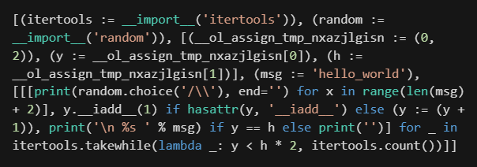

# One-Liner Generator for Python

A simple script that converts python scripts into only one line. 

## Example
**InputFile:**
```python
import random
y,h=0,2
msg='hello_world'
while y<h*2:
    for x in range(len(msg)+2):
        print(random.choice('/\\'),end='')
    y+=1
    if y==h:
        print('\n %s '%msg)
    else:
        print('')
```
**Generated:**
```python
[(itertools := __import__('itertools')), (random := __import__('random')), [(__ol_assign_tmp_nxazjlgisn := (0, 2)), (y := __ol_assign_tmp_nxazjlgisn[0]), (h := __ol_assign_tmp_nxazjlgisn[1])], (msg := 'hello_world'), [[[print(random.choice('/\\'), end='') for x in range(len(msg) + 2)], y.__iadd__(1) if hasattr(y, '__iadd__') else (y := (y + 1)), print('\n %s ' % msg) if y == h else print('')] for _ in itertools.takewhile(lambda _: y < h * 2, itertools.count())]]
```


## Usage
`python oneliner.py [input file] -o [output file]`  
Or use `python oneliner.py -h` for help.

## Limitation
This script requires python3.8+. Many statements are not convertable.  
Here are the statements that have already been implemented.
|statement|example|
|-|-|
|Expr|`print((1+1)*2)`|
|Assign|`a=1`<br>`a,b=b,a`|
|AugAssign|`a*=1`|
|If|`if a==0: ...`<br>`elif a>1: ...`<br>`else: ...`|
|For<sub> 1</sub>|`for i in range(10): ...`|
|While<sub> 1</sub>|`While a<100: ...`|
|Pass|`while 1: pass`|
|Import<sub> 2</sub>|`import math`<br> `import os,sys`<br>`import numpy as np`|

Remarks:
1. 'while-else', 'for-else', 'continue' and 'break' are not implmented.
2. 'from-import' is not implmented.

## Dependencies
- **CPython >= 3.9**